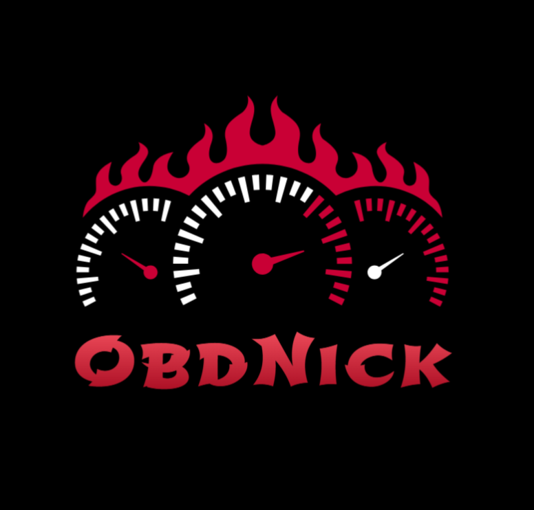

<p align="center">
  
</p>

<h1 align="center">ObdNick</h1>

<p align="center">
  <strong>Professional OBD-II racing dashboard for Android</strong><br/>
  Real-time engine data · Custom widgets · Bluetooth ELM327 · 0–100 km/h timing
</p>

<p align="center">
  
  
  
</p>

<p align="center">
  <a href="https://www.paypal.com/donate/?hosted_button_id=PYZM2HT8ZKPYN">
    
  </a>
</p>

---

# ObdNick v1.0

ObdNick is an OBD-II diagnostic and performance app built for enthusiasts. Customize your dashboard with dynamic gauges, monitor engine telemetry in real time, track 0–100 km/h acceleration, and read trouble codes — all through a clean racing-style interface.

**No ads. No subscriptions. No account required.**

This release is distributed as an **APK file only**. You do not need a computer, Android Studio, or source code to install it.

---

## Table of Contents

- [Requirements](#requirements)
- [Download & Install](#download--install)
- [Permissions](#permissions)
- [Getting Started](#getting-started)
- [Navigation & Menu](#navigation--menu)
- [Dashboard](#dashboard)
- [Performance (0–100 km/h)](#performance-0100-kmh)
- [Live Data](#live-data)
- [Diagnostics](#diagnostics)
- [Bluetooth Connection](#bluetooth-connection)
- [Vehicle Brand Recognition](#vehicle-brand-recognition)
- [Settings & Themes](#settings--themes)
- [Demo Mode](#demo-mode)
- [Support the project](#support-the-project)
- [Technical Reference](#technical-reference)

---

## Requirements

| Item | Detail |
|------|--------|
| **OS** | Android 7.0 (Nougat) or higher — API 24+ |
| **Package** | `com.example.obdnick` |
| **Hardware** | ELM327 **Bluetooth** OBD-II adapter *(optional with Demo Mode)* |
| **Distribution** | APK file (see [Download & Install](#download--install)) |

---

## Download & Install

### 1. Download the APK

Download **`ObdNick-v1.0.apk`** from the GitHub **Releases** page of this repository (or from the link provided with the release).

> Keep the file somewhere easy to find — usually the **Downloads** folder.

### 2. Allow installation from unknown sources

On first install, Android may block apps that are not from the Play Store.

| Android version | What to do |
|-----------------|------------|
| **Android 8+** | When prompted, tap **Settings** and allow installation from your browser or file manager for this install only |
| **Older devices** | Go to **Settings → Security** and enable **Unknown sources** (wording may vary by manufacturer) |

### 3. Install

1. Open the downloaded **`ObdNick-v1.0.apk`** file (Files app, Downloads notification, etc.)
2. Tap **Install**
3. When finished, tap **Open**

### 4. Pair your OBD adapter (before first use)

1. Plug the ELM327 adapter into your car’s OBD port and turn the ignition **ON** (engine can be off)
2. Open Android **Settings → Bluetooth**
3. Pair your ELM327 adapter (common names: `OBDII`, `ELM327`, `Vgate`, `OBD`)
4. Open **ObdNick** — the app will ask for permissions on first launch (see below)

### 5. First connection

1. Open the **☰ menu** → tap **CONNECT** (or go to the Connection screen)
2. Select your paired adapter
3. Wait for the connection banner — sensor scan runs automatically after connect
4. If your car brand is not detected, set it manually in **Settings → Vehicle brand**

---

## Permissions

ObdNick requests only what it needs to talk to the adapter and stay connected in the background.

| Permission | Why it is needed |
|------------|------------------|
| **Bluetooth** (Connect / Scan) | Connect to your ELM327 adapter and discover nearby devices (Android 12+) |
| **Location** (Android 11 and below) | Required by Android for Bluetooth device scanning on older OS versions |
| **Notifications** (Android 13+) | Show the foreground service notification while connected — keeps the Bluetooth link alive |

If you deny Bluetooth permissions, the app cannot connect to the adapter. You can still explore the UI with **Demo Mode**.

---

## Getting Started

1. **Pair your ELM327 adapter** in Android Bluetooth settings.
2. Open **ObdNick** — splash screen, then the Dashboard.
3. Grant permissions when asked.
4. The app **auto-connects** to the last device you used successfully.
5. While connecting, a **banner** shows progress and sensor scan status.
6. When connected, a brief **Connected** confirmation appears for a few seconds, then hides automatically.
7. Use the **☰ menu** (top-left) to switch screens.

> **Tip:** Enable **Demo Mode** in Settings to explore the app without a car or adapter.

---

## Navigation & Menu

Open the side menu with the **☰** icon. The drawer shows:

- **ObdNick** title at the top
- A **connection card** with status, vehicle brand (if known), adapter name, sensor count, and **Connect / Disconnect**
- Navigation items for all main screens
- **ObdNick · v 1.0** branding at the bottom of the drawer only

| Screen | Description |
|--------|-------------|
| **Connection** | Scan, pair, and connect to ELM327 adapters |
| **Dashboard** | Customizable live widget grid |
| **Performance** | 0–100 km/h stopwatch and run history |
| **Live Data** | Full list of decoded sensor readings |
| **Diagnostics** | Read and clear OBD trouble codes *(Beta)* |
| **Settings** | Theme, vehicle brand, Demo Mode, donations |

The top bar shows the **current screen name** only. When Demo Mode is active, a **Demo Mode Active** badge appears next to the title.

---

## Dashboard

The Dashboard is a **2-column grid** of widgets that update in real time.

### Widget types

| Type | Description |
|------|-------------|
| **Num** | Large digital readout with unit |
| **Bar** | Horizontal or vertical bar gauge with dynamic colors |
| **Gauge** | Analog needle gauge (RPM uses a dedicated racing dial) |
| **Arc** | Partial arc gauge with center value |
| **Graph** | Real-time scrolling line chart (last 40 samples) |

Each widget is bound to an **OBD PID** (sensor): RPM, Speed, Throttle, Coolant Temp, Intake Temp, Engine Load, MAF, and others supported by your vehicle.

### Fullscreen mode

Tap the **fullscreen** icon in the top bar on the Dashboard to hide the menu and show **widgets only** — ideal for mounting the phone in the car. Press **Back** to exit fullscreen.

### Edit mode

Tap the **Edit** button (bottom-right) to enter layout editing:

| Action | How |
|--------|-----|
| **Reorder** | Long-press a widget and drag |
| **Resize** | Drag the handle at the bottom-right corner |
| **Configure** | Tap the pencil icon → change PID, type, min/max, color thresholds |
| **Delete** | Tap the ✕ icon |
| **Add widget** | In edit mode the button becomes **+** — pick type and PID |
| **Done** | Tap **Done** (bottom-left) to save and resume live polling |

While editing, live data is **frozen** and Bluetooth polling is **paused** so the layout stays stable.

### Color thresholds

Define **color ranges** for any value (e.g. 0–3000 Green, 3000–6000 Yellow, 6000+ Red). Enable **Flash** on a range to pulse the widget when the value enters that zone.

The gauge **needle** respects the configured min/max arc; the **digital value** always shows the real reading.

### Default layout

On first launch: **RPM** (full-width gauge), **Speed** (digital), **Throttle** (arc). Layout is **saved automatically** and restored on restart.

---

## Performance (0–100 km/h)

Dedicated timing screen for acceleration from standstill to 100 km/h.

1. Tap **START** — timer enters *Armed* and waits for movement.
2. When **speed > 0 km/h**, timing starts (*Running*).
3. At **100 km/h**, the run completes (*Finished*) and is saved.
4. Tap **RESET** for a new run.

Past runs are listed with date and time. Speed is polled at **maximum frequency** on this screen for accurate timing.

---

## Live Data

Scrollable list of **all decoded sensors** available for your vehicle (or Demo Mode).

- Each row shows sensor name, formatted value, and unit
- Unread values show `---` until the first poll
- Header shows vehicle brand and how many sensors are shown vs. discovered
- Only **meaningful, decodable** readings are listed — raw hex dumps and unknown PIDs are hidden

### Smart polling

1. **On open** — all available PIDs are queried immediately
2. **While scrolling** — only **visible rows** (+ buffer) are polled continuously, saving bandwidth

Works with Bluetooth or Demo Mode. When both are active, **real vehicle data takes priority**.

---

## Diagnostics

Read and manage **Diagnostic Trouble Codes (DTCs)**. This screen is marked **Beta** — core functions work, but the module may evolve in future versions.

| Button | Action |
|--------|--------|
| **QUICK SCAN** | Fast DTC read |
| **DEEP SCAN** | Extended DTC read |
| **CLEAR MIL CODES** | Clears stored codes (check-engine light) — confirmation required |

Requires an active OBD Bluetooth connection (not available in Demo Mode alone).

---

## Bluetooth Connection

### Connection screen

- View **paired** and **discovered** devices
- Tap a device to connect
- **SCAN** searches for nearby adapters
- **DISCONNECT** ends the session

### Auto-connect

After splash, ObdNick tries to reconnect to the **last successful device**.

### Connection banner

| Phase | What you see |
|-------|----------------|
| **Connecting** | Spinner, adapter name, optional vehicle brand, sensor scan progress |
| **Connected** | Brief green confirmation (about 3 seconds), then banner hides |
| **Idle** | No persistent banner cluttering the screen |

### Stability

- ELM327 handshake on every connection (`ATZ`, `ATE0`, `ATL0`, `ATSP0`)
- Keep-alive monitors data flow — resets the socket if readings stop
- Foreground service keeps Bluetooth alive while connected
- One-time **Connection Successful** popup when the first engine PID arrives

---

## Vehicle Brand Recognition

ObdNick identifies your car’s **brand** (not model) to filter sensors and show a cleaner Live Data list.

### Automatic (VIN)

On connect, the app reads the vehicle **VIN** (OBD Mode 09) and maps the WMI prefix to a known brand:

| Brand | Detected via VIN |
|-------|------------------|
| Renault | ✅ |
| Volkswagen | ✅ |
| Honda | ✅ |
| Opel | ✅ |
| Fiat | ✅ |
| Citroën | ✅ (VIN only; not in manual selector) |

When recognized, the brand appears in the **drawer**, **connection banner**, and **Live Data** header.

> Many cars — especially some Renault models — do **not** expose the VIN over OBD. If you see no brand, use manual selection below.

### Manual selection (Settings)

Go to **Settings → Vehicle brand** and pick:

- **Auto (VIN)** — default; uses VIN when available
- **Renault**, **Volkswagen**, **Honda**, **Opel**, **Fiat** — force that brand’s sensor profile

Manual choice is **saved** and applies immediately — no reconnect needed. It overrides missing or wrong VIN detection.

---

## Settings & Themes

### Themes

Dark racing background with selectable accent colors:

| Theme | Accent |
|-------|--------|
| Dark | Default |
| Light | Light surface |
| Red | Racing red |
| Orange | Sunset orange |
| Green | Emerald green |
| Purple | Midnight purple |

### Vehicle brand

Manual brand selector — see [Vehicle Brand Recognition](#vehicle-brand-recognition).

### Demo Mode

Simulates realistic engine data without Bluetooth:

- Toggle **Demo Mode** in Settings
- Resets to **OFF automatically** every time the app is reopened
- While active, a **Demo Mode Active** badge appears in the top bar
- Simulated RPM, speed, throttle, load, temperatures, and MAF with physically coherent relationships
- Works on **Dashboard**, **Performance**, and **Live Data** — no adapter required
- Auto-connect is skipped if Demo Mode is already on at launch

### Donations

Tap **Donate with PayPal** at the bottom of Settings to support development.

---

## Demo Mode

| Feature | Works in Demo? |
|---------|----------------|
| Dashboard widgets | ✅ Yes |
| Fullscreen dashboard | ✅ Yes |
| Performance timer | ✅ Yes (simulated speed) |
| Live Data | ✅ Yes |
| Diagnostics | ❌ Requires Bluetooth |
| Vehicle brand (manual) | ✅ Yes (filters demo sensor list) |
| Auto-connect | Skipped when Demo Mode is on at launch |

Enable **Demo Mode** in Settings, then open Dashboard or Live Data — values update immediately without pairing an adapter.

---

## Support the project

ObdNick is free — no ads, no subscriptions.

<p align="center">
  <a href="https://www.paypal.com/donate/?hosted_button_id=PYZM2HT8ZKPYN">
    
  </a>
</p>

You can also tap **Donate with PayPal** inside **Settings**.

---

<br/>

<details>
<summary><h2>📋 Technical Reference — tap to expand</h2></summary>

> Internal architecture and protocol details for **ObdNick v1.0**.  
> End users only need the APK — this section is for curious developers and testers.

---

### Tech stack

| Layer | Technology |
|-------|------------|
| Language | **Kotlin 2.4** |
| UI | **Jetpack Compose** + **Material 3** |
| Architecture | **MVVM** + **Hilt** |
| Navigation | **Navigation Compose** |
| Persistence | **DataStore Preferences** + **kotlinx.serialization** (JSON) |
| Async | **Kotlin Coroutines**, **StateFlow**, **SharedFlow** |
| OBD | **obd-java-api** (Mode 01 PIDs, Mode 03/04/07 DTCs, Mode 09 VIN) |
| Drag & drop | **sh.calvin.reorderable 3.1.0** |
| Target | **minSdk 24**, **targetSdk 37**, **compileSdk 37** |

---

### Core modules

```
com.example.obdnick/
├── MainActivity.kt              NavHost, drawer, connection banner, fullscreen dashboard
├── CarViewModel.kt              Facade: BT, polling, DTC, vehicle profile, filtered PIDs
├── ObdBluetoothManager.kt       SPP socket, PID discovery, VIN read, DTC I/O
├── ObdConnectionService.kt      Foreground service while connected
├── bluetooth/
│   ├── ConnectivityManager.kt   Handshake, keep-alive, connection events
│   └── AutoConnectManager.kt    Last-device auto-reconnect
├── data/
│   ├── VehicleProfile.kt        Brand + VIN display labels
│   ├── vehicle/
│   │   ├── VehicleDatabase.kt   WMI → brand, extended PID sets per brand
│   │   └── VehicleBrandSelection.kt  Manual brand enum (Settings)
│   ├── ObdPidCatalog.kt         Standard PID definitions and formulas
│   ├── WidgetConfig.kt          Dashboard layout model
│   └── UserPreferencesRepository.kt  DataStore (theme, dashboard, brand, demo)
├── obd/
│   ├── PollingManager.kt        Adaptive / turbo / demo polling
│   ├── ObdVehicleReader.kt      Mode 09 VIN read with retries and parsers
│   ├── VehiclePidProfile.kt     Filter discovered PIDs by brand profile
│   ├── VehicleProfileResolver.kt  Merge VIN profile + manual brand override
│   └── ObdCommandParser.kt      ELM327 response → ObdReading
└── ui/                          Screens, drawer, gauges, settings
```

---

### Vehicle profile pipeline

```
Connect → discover raw PIDs (bitmask 0100/0120/0140…)
       → read VIN (Mode 09 PID 02) → VehicleProfile from WMI
       → merge with Settings manual brand (VehicleProfileResolver)
       → filter PIDs (VehiclePidProfile.filterDiscovered)
       → expose availablePids + vehicleProfile to UI
```

| Component | Role |
|-----------|------|
| `ObdVehicleReader` | Sends `0902` / `09 02`, multi-frame + regex fallback, `AT ST 96` timeout |
| `VehicleDatabase` | Maps WMI (`VF1` → Renault, `WVW` → VW, `ZFA` → Fiat, etc.) |
| `VehicleBrandSelection` | `AUTO`, `RENAULT`, `VOLKSWAGEN`, `HONDA`, `OPEL`, `FIAT` |
| `VehicleProfileResolver` | Manual brand overrides VIN when not `AUTO` |
| `VehiclePidProfile` | Allows standard catalog + status PIDs + brand `extendedPids`; hides undecodable junk |

Brand extended PIDs (examples): `56`, `61`, `62`, `8E` (Renault/VW/Opel/Fiat); Fiat also `5B`.

UI shows **brand name only** (`connectionLabel`), not model — model patterns exist internally for future use.

---

### Adaptive polling (`PollingManager`)

Subscriber model: each screen registers PIDs it needs.

| Mode | Behavior |
|------|----------|
| **Normal** | RPM + Speed every cycle; others every 4th cycle; 25 ms inter-command gap |
| **Paused** | Dashboard edit mode — no queries |
| **Background** | App not foreground — idle (~750 ms sleep) |
| **Turbo** | Single PID every **5 ms** — Performance screen speed |
| **Demo** | Simulated coherent data every **100 ms** — overrides Bluetooth while Demo Mode is on |

---

### OBD PID formulas (SAE J1979 Mode 01)

| PID | Name | Formula | Unit |
|-----|------|---------|------|
| `04` | Engine Load | `A × 100 / 255` | % |
| `05` | Coolant Temp | `A − 40` | °C |
| `0C` | RPM | `(A × 256 + B) / 4` | rpm |
| `0D` | Speed | `A` | km/h |
| `0F` | Intake Temp | `A − 40` | °C |
| `10` | MAF | `(A × 256 + B) / 100` | g/s |
| `11` | Throttle | `A × 100 / 255` | % |

Unknown PIDs return **no reading** in the UI (no raw hex fallback in normal display).

---

### Gauge mathematics (`GaugeMath.kt`)

```
ratio       = (value − min) / (max − min)   → clamp 0..1
needleAngle = startAngle + ratio × totalSweep
rotation    = needleAngle − 270°            (needle base points up)
```

Digital values are **never clamped** — only needle/bar fill respects min/max.

---

### Performance state machine

```
IDLE ──[START]──► ARMED ──[speed > 0]──► RUNNING ──[speed ≥ 100]──► FINISHED
Any non-IDLE ──[RESET]──► IDLE
```

Timer uses `SystemClock.elapsedRealtime()`. Runs stored as JSON in DataStore.

---

### Bluetooth handshake

```
connect → SPP RFCOMM
       → ATZ (1500 ms wait)
       → ATE0, ATL0, ATSP0
       → discoverSupportedPids()
       → read VIN profile
       → start ObdConnectionService + keep-alive
```

Keep-alive: if no reading for **3 s** → probe `0100`; on failure → reset socket.

---

### Diagnostics (Beta)

- DTC read/clear runs on **background IO thread**
- **15 s timeout** per operation to avoid UI freeze
- States: idle, scanning, success, error

---

### DataStore keys (v1.0)

| Key | Content |
|-----|---------|
| `app_theme` | `AppTheme` enum |
| `dashboard_config_json` | Widget grid layout |
| `performance_runs_json` | 0–100 run history |
| `last_device_mac` | Auto-connect target |
| `manual_vehicle_brand` | `VehicleBrandSelection` name |
| `demo_mode` | Boolean — reset to `false` on every cold start |
| `units` | `"metric"` (reserved) |

---

### UI notes (v1.0)

| Element | Behavior |
|---------|----------|
| Drawer width | **74%** of screen width |
| Branding | **ObdNick · v 1.0** only in drawer footer |
| Connection banner | Shown while connecting + 3 s after connect |
| Diagnostics | **Beta** badge in drawer and screen |
| Fullscreen dashboard | Immersive widgets-only; Back to exit |

---

### Permissions (manifest)

| Permission | Purpose |
|------------|---------|
| `BLUETOOTH_CONNECT` | Pair/connect (Android 12+) |
| `BLUETOOTH_SCAN` | Discovery (Android 12+) |
| `ACCESS_FINE_LOCATION` | Discovery on Android ≤ 11 |
| `POST_NOTIFICATIONS` | Foreground service (Android 13+) |
| `FOREGROUND_SERVICE_CONNECTED_DEVICE` | Connected-device service type |

---

### Known limitations (v1.0)

- VIN not available on all vehicles/adapters — use manual brand in Settings
- Model name is not shown in the UI (brand only)
- Diagnostics module is Beta
- APK may be debug-signed unless a separately signed build is provided

</details>

---

<p align="center">
  <a href="https://www.paypal.com/donate/?hosted_button_id=PYZM2HT8ZKPYN">
    
  </a>
</p>

<p align="center">
  <sub>ObdNick v1.0 · APK distribution · Built with Kotlin & Jetpack Compose</sub>
</p>
